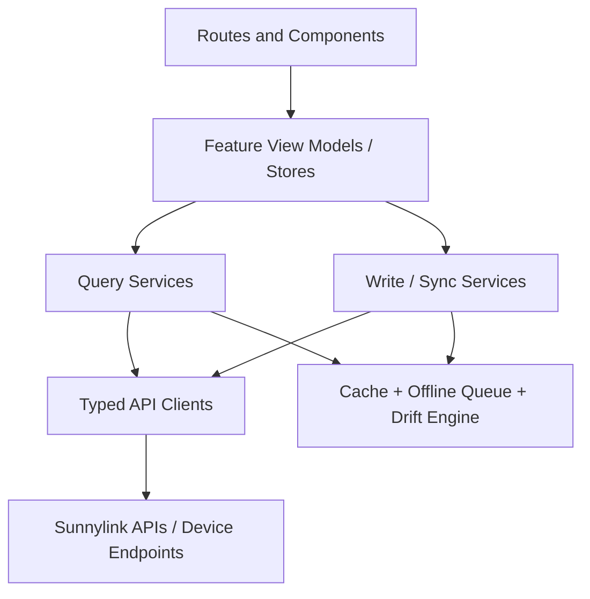

# Sunnylink Frontend Codebase Audit

Last reviewed: 2026-04-16

## Executive Summary

This is a client-heavy SvelteKit + Svelte 5 application for remotely managing sunnypilot/comma devices. The product surface is stronger than the structure underneath it: there is real thought in the sync model, schema-driven settings system, device status polling, offline queueing, and cache invalidation strategy. The app clearly solves real product problems, not just CRUD.

The main reason to redo it is not that the codebase is bad at everything. The reason is that the important behavior has accreted into a set of very large route components and god stores, so the system is becoming harder to reason about than the product itself. The rewrite should preserve the domain ideas while replacing the current distribution of responsibilities.

My short take:

- Product/domain model: stronger than average.
- UI/interaction polish: good.
- Architecture: workable, but too centralized and implicit.
- Type safety: mixed.
- Test posture: light for the amount of critical sync logic present.
- Rewrite recommendation: yes, but preserve the sync/caching/rules concepts and migrate behavior deliberately.

## Repo Shape

Approximate size from this workspace snapshot:

- 79 handwritten `.ts` / `.svelte` source files excluding generated OpenAPI types and tests
- About 21.4k lines across those files
- 5 test files
- 2 generated schema declaration files under `src/sunnylink/`

Largest files:

| File | Approx lines | Why it matters |
| --- | ---: | --- |
| `src/lib/types/settings.ts` | 2099 | Static settings catalog and legacy fallback definitions |
| `src/routes/dashboard/models/+page.svelte` | 1382 | Models feature page with fetching, state, search, favorites, push flow |
| `src/lib/components/schema/SchemaItemRenderer.svelte` | 1148 | Core schema-driven setting renderer and interaction logic |
| `src/lib/components/SettingsMigrationWizard.svelte` | 1085 | Multi-step migration UI and workflow |
| `src/routes/dashboard/+page.svelte` | 799 | Dashboard orchestration and backup flows |
| `src/routes/dashboard/settings/[category]/+page.svelte` | 786 | Settings page orchestration, fetching, schema/legacy bridging |
| `src/lib/api/device.ts` | 679 | Device API orchestration and status logic |
| `src/routes/dashboard/settings/+layout.svelte` | 645 | Global settings sync, prefetch, drift, cache, retry, banners |
| `src/routes/dashboard/osm/+page.svelte` | 629 | Maps flow and per-page data/cache logic |
| `src/routes/+layout.svelte` | 594 | App shell, sidebar, auth-sensitive navigation, global banners |

## What This App Actually Is

This is not a typical server-backed dashboard. It is closer to a browser-native remote control client.

Key product capabilities:

- Device discovery and selection
- Device online/offline/offroad telemetry
- Remote settings editing
- Schema-driven settings rendering with rules/capabilities
- Offline queueing and later sync
- Batched optimistic writes with verification
- Drift detection against cached settings
- Model browsing/switching
- Vehicle fingerprint/platform selection
- OSM region download management
- Settings backup and migration between devices
- PWA installability

## Runtime Architecture

### 1. Delivery model

The app is effectively a client-side SPA delivered via SvelteKit static adapter.

- `src/routes/+layout.ts` sets `ssr = false`
- `src/routes/+page.ts` sets `ssr = false`
- `src/routes/dashboard/+page.ts` sets `ssr = false`
- `vite.config.ts` uses `@sveltejs/adapter-static` plus `vite-plugin-pwa`

That means most meaningful behavior happens in the browser:

- Auth
- Device fetching
- Device polling
- Local caching
- Sync queueing
- Drift detection

This architecture makes sense for a PWA talking directly to a remote API, but it also means the client owns a lot of state and failure handling.

### 2. Shell and route layout

The root shell in `src/routes/+layout.svelte` is a true orchestration layer, not just a visual layout.

It handles:

- navigation/sidebar composition
- device list hydration from streamed layout data
- selected device status badge behavior
- initial status checks for all devices
- polling startup
- pairing and migration modal entry points
- global banners, toasts, theme, and PWA prompt setup

This file is acting as:

- app shell
- device bootstrapper
- auth recovery surface
- global UX coordinator

That is convenient, but it is also one of the architectural pressure points.

### 3. Auth

Auth is implemented with Logto in `src/lib/logto/auth.svelte.ts`.

The good:

- simple API
- explicit timeout wrappers around SDK calls
- centralized `AuthState`
- retry-on-expired-session behavior is thought through

The concern:

- it is still a global mutable singleton
- auth refresh behavior is coupled into the custom fetch layer
- there is no explicit session service boundary beyond the store itself

### 4. API layer

There are two generated OpenAPI clients in `src/lib/api/client.ts`:

- `v1Client`
- `v0Client`

Important facts:

- `customFetch` wraps both clients
- 401/403 handling triggers `authState.refreshSession()`
- API timeout behavior is global
- `API_BASE_URL` is hardcoded to `https://stg.api.sunnypilot.ai`

That last point is one of the clearest rewrite targets. Hardcoding staging in client code is risky and inflexible.

### 5. State model

The app uses global rune-based singleton stores under `src/lib/stores/`.

Most important stores:

- `device.svelte.ts`
- `schema.svelte.ts`
- `statusPolling.svelte.ts`
- `batchPush.svelte.ts`
- `pendingChanges.svelte.ts`
- `driftStore.svelte.ts`
- `preferences.svelte.ts`
- `theme.svelte.ts`
- `versionPoller.svelte.ts`

The single biggest architectural fact in this repo is that `deviceState` is the de facto source of truth for almost everything:

- selected device
- device settings metadata
- device values
- online/offline status
- offroad status
- telemetry
- aliases
- staged changes
- migration wizard state
- backup state

This is the classic "god store" pattern. It works until the team wants isolation, reliable testing, or feature ownership boundaries.

### 6. Settings architecture

This is the most important part of the codebase.

There are really two settings systems:

1. Legacy static definitions in `src/lib/types/settings.ts`
2. New schema-driven rendering using device-provided metadata:
   - `src/lib/types/schema.ts`
   - `src/lib/stores/schema.svelte.ts`
   - `src/lib/components/schema/SchemaPanel.svelte`
   - `src/lib/components/schema/SchemaItemRenderer.svelte`
   - `src/lib/rules/evaluator.ts`

The new schema path is much stronger architecturally than the legacy path.

What it does well:

- device can describe panels, sections, items, options, units, visibility, enablement
- capability-based and param-based rules are first-class
- brand-specific vehicle settings fit into the same model
- renderer can adapt based on schema rather than hardcoded UI rules

Why this matters:

This is the part of the app you absolutely should preserve conceptually in a rewrite. It is the clearest example of domain logic being moved out of raw view conditionals and into a more portable configuration model.

### 7. Sync architecture

This app has a real sync model, not just "POST and hope."

There are multiple layers:

- `batchPush.svelte.ts`: online optimistic writes, debounced batching, verification readback, conflict handling
- `pendingChanges.svelte.ts`: offline desired-state queue persisted in localStorage
- `driftStore.svelte.ts` and `utils/drift.ts`: compare cached values to fresh values to detect on-device changes
- `statusPolling.svelte.ts`: adaptive refresh of device reachability
- `versionPoller.svelte.ts`: watch `ParamsVersion` for device-side config changes
- `valuesCache.ts`: localStorage cache keyed by device and git commit

This is the strongest domain engineering in the repo.

The app already knows about:

- online vs offline behavior
- optimistic UI
- debounce windows
- server uncertainty
- device-side conflicts
- stale cache invalidation
- offroad-only constraints
- reconnect flushing

That is real product complexity, and it is easy to lose during a rewrite if you treat the current app like a normal settings UI.

## Main Feature Flows

### Device bootstrap flow

1. `src/routes/+layout.ts` streams the paired device list
2. `src/routes/+layout.svelte` hydrates devices into `deviceState`
3. It runs initial `checkDeviceStatus()` for all devices
4. `statusPolling` takes over ongoing refresh

Important implication:

The route layer and the store layer are tightly coupled. Route data is not just consumed by components; it mutates global singleton state that many other surfaces depend on.

### Device status flow

`src/lib/api/device.ts` `checkDeviceStatus()` does more than its name implies.

It:

- checks device reachability
- fetches telemetry
- fetches schema metadata
- fetches force-offroad status
- hydrates device settings from schema
- updates `schemaState`
- updates `deviceState`
- kicks off fetches for basic info params
- falls back to legacy settings fetch when schema metadata is unavailable

This is a major smell. It is effectively a workflow engine hiding inside an API helper.

### Settings page flow

The settings route pair:

- `src/routes/dashboard/settings/+layout.svelte`
- `src/routes/dashboard/settings/[category]/+page.svelte`

Together these handle:

- cache hydration
- drift baseline capture
- background prefetch of all schema keys
- version-change invalidation
- reconnect retry
- offline queue flushing
- offroad-blocked pending writes
- per-category value fetch
- schema panel navigation via query params
- legacy fallback rendering

This is powerful, but it is far too much responsibility for route files.

### Models flow

`src/routes/dashboard/models/+page.svelte` is effectively a mini-application inside the application.

It contains:

- schema loading
- cached hydration
- fetch/revalidate logic
- model list parsing
- favorites state
- search/filter UI
- download monitoring
- action confirmations
- legacy model setting rendering

The feature is rich, but the file is too large to be comfortably evolvable.

### Vehicle flow

The vehicle feature is a good example of real-world logic hidden in UI code.

Key files:

- `src/routes/dashboard/settings/vehicle/+page.svelte`
- `src/lib/components/vehicle/VehicleSelector.svelte`

This area handles:

- current platform bundle
- fingerprint extraction from persistent params
- CarList fetching and caching
- optimistic vehicle selection
- rollback on failure
- brand-specific settings

Again, the product logic is good. The packaging is not.

### Backup and migration flow

Key files:

- `src/lib/utils/settings.ts`
- `src/lib/components/SettingsMigrationWizard.svelte`
- `src/routes/dashboard/+page.svelte`

The backup system is more serious than it first looks:

- filters excluded/ephemeral keys
- supports retries for failed fetches
- sorts output for determinism
- supports device-reported keys over static fallback
- tracks unavailable settings

This is worth preserving as a domain service in a rewrite.

## Strengths

### 1. The team understood the product's real complexity

The app is not architecturally naive. It knows the domain has:

- intermittent device connectivity
- authoritative device-side state
- long-running writes
- schema variability across firmware/device versions
- constraints based on capabilities, vehicle brand, and offroad status

That understanding is the codebase's biggest strength.

### 2. Schema-driven settings are the right direction

The move away from static frontend-only definitions toward device-generated schema is the strongest architectural decision in the repo.

This improves:

- forward compatibility
- UI consistency
- rule reuse
- brand-specific customization
- feature rollout without constant frontend rewrites

### 3. Sync behavior is more mature than average

The offline queue, optimistic batching, verification polling, and drift detection show good product thinking.

This is not superficial polish. It is core reliability work.

### 4. Caching is intentional, not accidental

The code uses:

- GitCommit-keyed value cache
- schema cache with TTL
- model cache
- OSM cache
- car list cache
- last-known commit bootstrap key

Most caches have clear invalidation stories, which is better than many mature apps.

### 5. Comments are generally useful

A lot of comments explain why the code exists, not just what the syntax does. That is a good sign.

### 6. There is some testing around domain logic

The best-covered area is the rules engine and backup key selection logic. That matches the parts most likely to benefit from pure tests.

## Weaknesses

### 1. Global state is overloaded

`deviceState` mixes:

- remote domain state
- local optimistic state
- UI workflow state
- modal state
- migration state
- backup state

This makes it hard to:

- isolate bugs
- test behavior
- understand ownership
- reason about side effects

### 2. Too much logic lives in Svelte components

Many route/components contain substantial workflow logic that should live in services or domain modules.

Examples:

- `src/routes/dashboard/settings/+layout.svelte`
- `src/routes/dashboard/settings/[category]/+page.svelte`
- `src/routes/dashboard/models/+page.svelte`
- `src/lib/components/schema/SchemaItemRenderer.svelte`
- `src/lib/components/vehicle/VehicleSelector.svelte`

These files are not just rendering. They are coordinating async state machines.

### 3. File size is a symptom of missing boundaries

Several files are over 500-1000 lines. That is not automatically bad, but here it correlates with too many responsibilities per file.

The biggest risk is not length itself. It is that behavior is hard to relocate or reuse.

### 4. The API layer is not actually a thin API layer

`src/lib/api/device.ts` contains:

- transport
- fallback logic
- schema hydration
- state mutation
- domain decoding
- orchestration

It should likely be split into:

- transport client
- device status service
- schema service
- params service
- write service

### 5. Type safety is inconsistent

There is good type work in some places, but the repo still leans on `any` in a lot of important areas.

Examples include:

- device lists and device objects in layouts/pages
- vehicle/car list structures
- migration comparison data
- API error objects
- various parsed JSON payloads

This matters because this app's hardest problems are state transitions and shape mismatches.

### 6. Legacy and new settings systems coexist in a messy way

The coexistence is understandable, but it creates permanent branching complexity:

- static settings definitions
- schema settings
- adapter layer from legacy to schema rendering
- fallback fetch logic

A rewrite should deliberately choose how long that dual system will survive.

### 7. Route/layout coupling is high

Layout and page files mutate global stores directly and often own side-effect timing.

That makes navigation behavior part of the business logic, which is fragile.

### 8. Environment and configuration are too implicit

Problems:

- hardcoded staging API base URL
- no obvious runtime environment abstraction
- strong assumption of browser-only execution
- lots of behavior tied directly to `localStorage`

### 9. Large static definitions file is a maintenance hotspot

`src/lib/types/settings.ts` is effectively product configuration, fallback metadata, and old UI contract bundled into one massive TypeScript file.

That should probably become data, not code.

### 10. Error handling is mostly local and imperative

There are many `console.error` / `console.warn` branches, but not much in the way of:

- centralized error taxonomy
- structured reporting
- shared retry policies
- reusable failure states

## Best Practices Being Followed

- Using generated OpenAPI types instead of hand-rolled request typing
- Clear attempt at stale-while-revalidate UX
- Optimistic writes with rollback/conflict handling
- Capability/rule evaluation separated from UI markup
- Local persistence for user preferences and offline state
- Cache invalidation keyed by software version (`GitCommit`)
- Timeouts around network calls to prevent hangs
- Some pure-function tests around tricky logic
- Good use of progressive enhancement through PWA support
- Parallel fetching in many places where latency matters

## Best Practices Not Being Followed

- Separation of domain logic from components
- Small-module / single-responsibility discipline
- Consistent strong typing at feature boundaries
- Centralized environment config
- Centralized error model and observability
- Clear layering between transport, domain services, stores, and views
- Sufficient integration tests for critical sync flows
- Avoiding giant singleton stores
- Avoiding duplicated fetch/cache patterns across feature pages

## Hidden Couplings You Need To Respect In A Rewrite

These are the behaviors most likely to break if someone rewrites "just the UI":

1. `checkDeviceStatus()` is not just status.
   It also updates schema, settings metadata, telemetry, offroad state, and basic param values.

2. `valuesCache`, `versionPoller`, `driftStore`, and settings prefetch all work together.
   If you replace one without the others, you can easily lose drift detection or cache correctness.

3. Online writes and offline writes are different systems.
   `batchPush` and `pendingChanges` overlap conceptually but behave differently for good reasons.

4. Offroad-only constraints affect sync, not just UI.
   Pending changes can be blocked and later unblocked based on device driving state.

5. Schema capabilities are part of rendering and eligibility logic.
   They are not optional metadata.

6. Vehicle selection changes downstream schema/capability behavior.
   It is not an isolated form control.

7. Legacy fallback still matters for older device support.
   If you drop it, you are making a product decision, not a refactor.

## What I Would Preserve

- Device-provided schema as the long-term settings contract
- Rule evaluator concept
- Offline desired-state queue concept
- Batched optimistic writes with verification
- Drift detection model
- GitCommit-based cache invalidation
- Brand-specific vehicle settings model
- Backup key filtering logic

These are the parts that encode real product intelligence.

## What I Would Rebuild First

### 1. Replace god stores with feature stores plus services

Possible split:

- `sessionStore`
- `deviceCatalogStore`
- `deviceRuntimeStore`
- `schemaStore`
- `settingsSyncStore`
- `modelsStore`
- `vehicleStore`
- `mapsStore`

Each backed by domain services instead of route files.

### 2. Extract service layer from components

Example service boundaries:

- `DeviceBootstrapService`
- `DeviceStatusService`
- `SchemaService`
- `SettingsQueryService`
- `SettingsWriteService`
- `OfflineQueueService`
- `DriftService`
- `BackupService`
- `ModelService`
- `VehicleService`

### 3. Normalize async state

Right now each feature invents its own loading/retrying/revalidating flags.

Move to a shared async-state pattern so every feature does not reinvent:

- idle
- loading
- refreshing
- success
- error
- stale

### 4. Convert static settings definitions into data

That giant file should become structured config or generated data. Keep TypeScript types, but stop hand-maintaining that much product metadata in executable code.

### 5. Unify params fetching/writing

Right now similar patterns appear in settings, models, OSM, and vehicle flows.

There should be one obvious way to:

- fetch params
- decode params
- cache params
- optimistically update params
- verify params

## Suggested Target Architecture

One good rewrite shape would look like this:

Interpretation:

- Components render and dispatch intents
- Feature stores/view models coordinate state for one feature only
- Query services fetch/merge/cache domain data
- Write services own optimistic writes, queueing, verification, rollback
- Transport stays thin

## If You Redo It, Do It In This Order

1. Define the long-term domain model first.
   Especially devices, schema, params, writes, queue entries, drift entries, and capabilities.

2. Freeze behavior before redesigning UI.
   Write tests or behavior notes around:
   - offline queue
   - offroad-blocked changes
   - batched writes
   - drift detection
   - schema fallback
   - backup filtering

3. Extract services before rewriting visuals.
   If you only restyle the current app, you keep the current coupling.

4. Rewrite feature by feature behind the same domain contracts.
   Suggested order:
   - auth/session bootstrap
   - device list and status
   - schema/settings read path
   - settings write path
   - backup/migration
   - models
   - vehicle
   - OSM/maps

5. Decide explicitly whether legacy settings fallback still exists.
   Do not let that remain accidental.

## Risk Areas During Rewrite

- Losing device-status side effects currently buried in `checkDeviceStatus()`
- Breaking drift detection by changing cache timing
- Breaking optimistic UI rollback semantics
- Losing reconnect/offroad flush behavior
- Regressing vehicle brand capability refresh
- Reimplementing schema rendering but forgetting legacy edge cases

## Testing and Tooling Assessment

### What exists

Tests exist for:

- rules engine: `src/lib/rules/evaluator.spec.ts`
- backup/settings utility behavior: `src/lib/utils/settings.spec.ts`
- auth module basics: `src/lib/logto/auth.spec.ts`
- one minimal page render test: `src/routes/page.svelte.spec.ts`
- one demo test: `src/demo.spec.ts`

Tooling exists for:

- `pnpm check`
- `pnpm test`
- coverage via Vitest
- browser tests via Playwright-backed Vitest browser project

### What is missing

There is little or no meaningful integration coverage for:

- device bootstrap
- online/offline transitions
- pending changes and flush behavior
- batched write verification
- drift detection across cache refresh
- schema rendering end-to-end
- model switching flow
- vehicle selection flow

For a rewrite, those are the tests that matter most.

### Verification status in this workspace

I could not complete `pnpm check` or `pnpm test` from this environment.

Reasons observed on 2026-04-16:

- `node_modules` are not present in this workspace snapshot
- dependency install hit a Node engine mismatch under Node `25.8.0`
- even with relaxed engine checks, package download failed because network access to `registry.npmjs.org` was unavailable in this environment

So the audit above is based on static code analysis, not a successful local verification run.

## Final Verdict

This is a thoughtful but over-concentrated frontend.

The codebase is not weak because the team ignored complexity. It is strained because the team absorbed a lot of product complexity into the browser and then let the implementation center around a few very large stores and components.

If you redo it:

- keep the domain ideas
- rewrite the boundaries
- preserve behavior before changing presentation

If you do not preserve the sync, drift, caching, and schema concepts, the rewrite will likely look cleaner while behaving worse.
